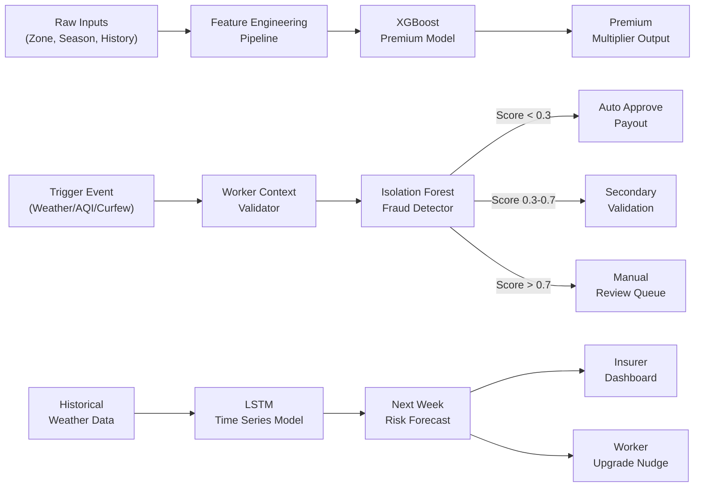

# GigShield — AI-Powered Parametric Income Insurance for India's Gig Economy

> **Guidewire DEVTrails 2026 | Unicorn Chase | Phase 1 Submission**
> *"Every rainstorm costs a rider. GigShield makes sure it doesn't."*

## Problem Statement

India's 15 million+ gig delivery workers (Zomato, Swiggy, Zepto, Amazon, Blinkit) are the invisible backbone of the digital economy. Yet they operate with **zero income protection**.

When external disruptions strike — a cyclone in Mumbai, a curfew in Ahmedabad, a red AQI alert in Delhi — these workers lose **20–30% of their monthly earnings** with absolutely no safety net. They cannot claim health insurance for a lost shift. They cannot file a vehicle claim for a flood-halted delivery. They simply absorb the loss.

**GigShield changes that.** We insure the *income*, not the asset. Triggered automatically. Paid instantly.

---

## Our Solution

**GigShield** is an AI-enabled **parametric income insurance platform** built exclusively for India's platform-based delivery partners. When a verified disruption event (weather, pollution, curfew, platform outage) crosses a threshold, GigShield:

1. **Detects the disruption automatically** via real-time API monitoring
2. **Validates the worker's context** (were they active? in the affected zone?)
3. **Approves the claim instantly** using our AI fraud detection engine
4. **Disburses the payout** directly to UPI/bank within minutes — no paperwork, no wait

> **Coverage Scope**: GigShield covers **loss of income ONLY** due to external disruptions. We strictly exclude health, life, accident, and vehicle repair coverage.

---

## Persona & Scenarios

### Chosen Persona: **Food Delivery Partners (Zomato / Swiggy)**

We focus on **two-wheeler food delivery riders** operating in Tier-1 Indian cities. They:

- Work 8–12 hours/day, 6 days/week
- Earn ₹600–₹1,200/day depending on orders and weather bonuses
- Are completely unprotected from external income disruptions
- Are highly mobile (app-native), making digital-first insurance viable

---

### Persona Scenarios

#### Scenario 1 — Raju, Mumbai (Monsoon Blackout)

> *"It's July. I checked the app. Orange alert. No orders coming. Lost 8 hours."*

Raju has subscribed to GigShield's **₹49/week Monsoon Shield** tier. At 2 PM, the IMD API reports **rainfall > 64.4 mm/hr** in his pincode zone. GigShield auto-detects the trigger, validates Raju was logged in on Zomato at trigger time, and initiates a payout of ₹320 (covering 4 disrupted hours) — credited to his UPI in 7 minutes.

**No claim filed. No call made. Raju just got paid.**

---

#### Scenario 2 — Priya, Delhi (Severe Pollution Lockdown)

> *"AQI hit 450. The municipal order said no two-wheelers. I lost the whole day."*

Priya holds a **₹59/week AQI Shield** policy. CPCB's live AQI API crosses 400 in her zone. GigShield cross-validates with the city's civic order feed, confirms she was scheduled to work (last app ping < 2 hours before trigger), and processes a full-day income payout of ₹700 automatically.

---

#### Scenario 3 — Arjun, Ahmedabad (Local Curfew)

> *"Riots broke out near SG Highway. Section 144 declared. Swiggy suspended orders in my zone."*

Arjun has the **₹39/week Civil Disruption Cover**. GigShield's social/news API feed detects a verified Section 144 zone matching Arjun's last GPS ping. Platform API confirms order suspension in that zone. Arjun receives a half-day payout within 15 minutes.

---

## Application Workflow

```
┌─────────────────────────────────────────────────────────────────────────┐
│                         GIGSHIELD PLATFORM FLOW                         │
└─────────────────────────────────────────────────────────────────────────┘

  WORKER ONBOARDING
  ─────────────────
  [Sign Up via Mobile Web]
        │
        ▼
  [KYC: Aadhaar + Platform ID Verification]
        │
        ▼
  [AI Risk Profiling] ──► Zone Risk Score + Earnings History Analysis
        │
        ▼
  [Weekly Plan Selection] ──► ₹29 / ₹49 / ₹79 per week
        │
        ▼
  [UPI AutoPay Setup] ──► Premium deducted every Monday morning
        │
        ▼
  [Active Policy Dashboard] ──► Worker can see coverage status live

  ─────────────────────────────────────────────────────────────────────

  DISRUPTION DETECTION (Background — Always Running)
  ───────────────────────────────────────────────────
  [Weather API] + [AQI Feed] + [News/Curfew API] + [Platform Status API]
        │
        ▼
  [Trigger Engine] ──► Checks thresholds every 15 minutes per zone
        │
        ▼
  [Worker Context Validator] ──► Was this worker active? In-zone? Logged in?
        │
        ├── FAIL ──► No payout. Log for audit.
        │
        └── PASS ──► Send to AI Fraud Check

  ─────────────────────────────────────────────────────────────────────

  AI FRAUD DETECTION + PAYOUT
  ────────────────────────────
  [Fraud Model Check]
        │
        ├── Flagged ──► Manual Review Queue (Admin Dashboard)
        │
        └── Approved ──► [Instant UPI Payout] ──► Worker notified via SMS + App
```

---

## Weekly Premium Model

GigShield operates on a **weekly subscription model** aligned to the typical gig worker earnings cycle (weekly payouts from Zomato/Swiggy/Zepto).

### Premium Tiers

| Tier                  | Weekly Cost | Coverage Cap | Disruptions Covered                                       |
| --------------------- | ----------- | ------------ | --------------------------------------------------------- |
| **BasicShield** | ₹29/week   | ₹500/week   | Heavy rain (>64mm), Severe flood                          |
| **ProShield**   | ₹49/week   | ₹900/week   | + AQI >300, Heatwave >45°C, Hailstorm                    |
| **UltraShield** | ₹79/week   | ₹1,500/week | + Curfew/Section 144, Platform outage >4hrs, Strike zones |

### How Weekly Pricing Works

- **Billing Day**: Every **Monday 6:00 AM** — auto-deducted via UPI AutoPay
- **Coverage Window**: Monday 6:00 AM → Sunday 11:59 PM
- **Pro-rated Refund**: If worker deactivates mid-week, remaining days refunded (UltraShield only)
- **Missed Premium Handling**: 24hr grace period, then policy suspended (NOT cancelled)
- **Claim Payout Cap**: Cannot exceed weekly premium × 20 in a single week

### Dynamic Premium Adjustment (AI-Powered)

Our ML model adjusts the base premium ±30% based on:

- **Zone Risk Score**: Historical disruption frequency in worker's operating zone
- **Seasonal Factor**: Monsoon season premiums increase for rain cover
- **Worker Reliability Score**: Consistent app-active workers get loyalty discounts
- **Claim History**: Workers with clean fraud history get progressive discounts

> **Example**: Raju in Mumbai Kurla (high-flood zone) during monsoon pays ₹62/week for ProShield instead of ₹49. Priya in Delhi Dwarka (low-flood, high-AQI) pays ₹54/week for the same plan.

---

## Parametric Triggers

Parametric insurance pays based on **objective, measurable external events** — not subjective damage assessments. No surveyor, no inspection, no delay.

### Trigger Matrix

| Trigger ID | Event Type           | Threshold                         | Data Source                | Coverage Activation      |
| ---------- | -------------------- | --------------------------------- | -------------------------- | ------------------------ |
| T-01       | Heavy Rainfall       | > 64.4 mm/hr (IMD Red Alert)      | OpenWeatherMap + IMD API   | Immediate, zone-wide     |
| T-02       | Flash Flood          | Flood depth > 30cm in zone        | IMD / NDMA Flood API       | Immediate, zone-wide     |
| T-03       | Severe AQI           | AQI Index > 300 (Very Poor)       | CPCB Real-time API         | 2-hour sustained trigger |
| T-04       | Extreme Heat         | Temperature > 45°C (Heat Wave)   | IMD API                    | Active hours 11AM–4PM   |
| T-05       | Curfew / Section 144 | Official order in GPS zone        | News API + Govt Feed       | Immediate, verified zone |
| T-06       | Cyclone / Storm      | IMD Orange/Red cyclone alert      | IMD Cyclone API            | Pre-trigger 6hr advance  |
| T-07       | Platform Outage      | App downtime > 4 continuous hours | Platform status monitoring | UltraShield only         |

### Payout Calculation Formula

```
Payout = min(
    (Hours Disrupted × Worker's Hourly Rate Estimate),
    Weekly Coverage Cap
)

Where:
  Hours Disrupted     = Disruption duration, capped at 8 hours/day
  Hourly Rate         = Declared earnings / declared active hours/week
  Weekly Coverage Cap = Tier-specific cap (₹500 / ₹900 / ₹1,500)
```

---

## 📱 Platform Choice — Web (Mobile-First Progressive Web App)

### Decision: **Mobile-First Progressive Web App (PWA)**

We chose a **PWA over a native app** for the following reasons:

| Factor                    | Native App                | PWA (Our Choice)         |
| ------------------------- | ------------------------- | ------------------------ |
| Installation friction     | High (app store download) | Zero (browser bookmark)  |
| Device storage required   | 40–80MB                  | < 2MB cached             |
| Update distribution       | App store review cycle    | Instant server-side push |
| Offline support           | Yes                       | Yes (Service Workers)    |
| Push notifications        | Yes                       | Yes (Web Push API)       |
| Access for low-end phones | Moderate                  | Excellent                |
| Development cost          | 2× (iOS + Android)       | Single codebase          |

**Key Insight**: 80% of India's gig workers use Android phones with 32–64GB storage, often reluctant to install new apps. A PWA with "Add to Home Screen" reduces onboarding friction dramatically — critical for our sub-₹100/week demographic.

---

## AI/ML Integration Plan

### Module 1: Dynamic Premium Calculation Engine

**Algorithm**: Gradient Boosted Decision Trees (XGBoost)

**Features**:

- Worker's operating zone (lat/long cluster)
- Historical disruption frequency in zone (past 24 months)
- Current month / season
- Worker's avg weekly active hours
- Worker's claim history (clean history = discount)
- Platform (Zomato vs Swiggy vs Zepto — different risk profiles)

**Output**: `adjusted_premium_multiplier` (0.7 to 1.3× base price)

**Training Data**: Synthetic dataset (Phase 1) → Real anonymized data (Phase 2+)

---

### Module 2: AI Fraud Detection Engine

**Algorithm**: Isolation Forest + Rule-Based Override Layer

**Fraud Signals Detected**:

- **GPS Spoofing**: Worker claims to be in disrupted zone but GPS trail shows otherwise
- **Temporal Anomaly**: Claim filed for disruption that occurred before policy activation
- **Cluster Fraud**: Multiple accounts claiming from same device fingerprint
- **Fake Active Status**: Worker marked "active" on platform but delivery count = 0
- **Repeat Pattern Abuse**: Suspiciously consistent claims every disruption event

**Model Output**: `fraud_score` (0.0–1.0)

- < 0.3 → Auto-approve payout
- 0.3–0.7 → Secondary validation (location cross-check)
- > 0.7 → Manual review queue
  >

---

### Module 3: Predictive Risk Modeling

**Algorithm**: LSTM Time Series + Weather Pattern Clustering

**Purpose**: Predict next-week disruption probability per zone, used to:

- Nudge at-risk workers to upgrade their tier before monsoon hits
- Pre-alert the payout reserve fund for high-risk weeks
- Generate the insurer's "Next Week Disruption Forecast" dashboard

---

## System Architecture

### Frontend Architecture

```
PWA (React + Vite)
├── Worker App (Mobile-First)
│   ├── Onboarding Flow (KYC + Platform ID)
│   ├── Policy Dashboard (Live coverage status)
│   ├── Payout History & Notifications
│   └── Premium Wallet (UPI AutoPay)
└── Admin / Insurer Dashboard
    ├── Real-time Trigger Monitoring Map
    ├── Fraud Review Queue
    ├── Loss Ratio Analytics
    └── Predictive Disruption Forecast
```

### Backend Architecture

```
Node.js + Express (REST API)
├── Auth Service          → JWT + Aadhaar OTP
├── Policy Service        → Weekly plan CRUD, premium billing
├── Trigger Engine        → Cron every 15min, API polling per zone
├── Claims Service        → Auto-initiation + fraud scoring pipeline
├── Payout Service        → UPI mock gateway integration
└── Analytics Service     → Aggregated metrics for dashboard
```

### ML Pipeline

```
Python (FastAPI microservice)
├── /predict/premium      → XGBoost premium multiplier
├── /score/fraud          → Isolation Forest fraud score
└── /forecast/disruption  → LSTM next-week risk prediction
```

---

## 🗺️ ML Model Architecture (Mermaid Diagram)



---

## 🛠️ Tech Stack

### Frontend

| Layer         | Technology                | Reason                                 |
| ------------- | ------------------------- | -------------------------------------- |
| Framework     | **React 18 + Vite** | Fast HMR, modern tooling               |
| Styling       | **Tailwind CSS**    | Utility-first, mobile-first responsive |
| PWA           | **Vite PWA Plugin** | Service worker, offline caching        |
| State         | **Zustand**         | Lightweight, no boilerplate            |
| Charts        | **Recharts**        | Analytics dashboard visualizations     |
| Maps          | **Leaflet.js**      | Zone-based disruption map              |
| Notifications | **Web Push API**    | Instant payout alerts                  |

### Backend

| Layer    | Technology                     | Reason                          |
| -------- | ------------------------------ | ------------------------------- |
| Runtime  | **Node.js 20 + Express** | Fast, async, widely supported   |
| Database | **PostgreSQL**           | Structured policy + claims data |
| Cache    | **Redis**                | Session store + trigger dedup   |
| Queue    | **Bull (Redis-backed)**  | Async payout processing         |
| Auth     | **JWT + Twilio OTP**     | Aadhaar-linked mobile auth      |
| API Docs | **Swagger/OpenAPI**      | Clean API documentation         |

### ML / AI

| Layer       | Technology                       | Reason                       |
| ----------- | -------------------------------- | ---------------------------- |
| Serving     | **FastAPI (Python)**       | Async ML inference endpoints |
| Models      | **XGBoost + Scikit-learn** | Premium + fraud models       |
| Time Series | **PyTorch LSTM**           | Disruption forecasting       |
| Data        | **Pandas + NumPy**         | Feature pipelines            |
| Model Store | **MLflow (local)**         | Experiment tracking          |

### External APIs & Integrations

| Integration     | Provider                                 | Usage                          |
| --------------- | ---------------------------------------- | ------------------------------ |
| Weather         | **OpenWeatherMap API** (free tier) | Rain, temp, storm triggers     |
| AQI             | **CPCB / AQI India API** (free)    | Pollution triggers             |
| Payment         | **Razorpay Test Mode**             | Simulated UPI payouts          |
| Platform Status | **Mock JSON Server**               | Simulated app outage detection |
| News/Curfew     | **NewsAPI (free tier)**            | Curfew / strike detection      |

### DevOps & Infrastructure

| Layer            | Technology                                                |
| ---------------- | --------------------------------------------------------- |
| Hosting          | **Vercel** (Frontend) + **Railway** (Backend) |
| CI/CD            | **GitHub Actions**                                  |
| Containerization | **Docker Compose** (local dev)                      |
| Monitoring       | **UptimeRobot** (free tier)                         |

---

## Development Plan

### Phase 1 — Ideation & Foundation (March 4–20) ✅ CURRENT

- [X] Problem analysis and persona definition
- [X] System architecture design
- [X] Tech stack finalization
- [X] This README + repository setup
- [ ] Wireframes for Worker App and Admin Dashboard
- [ ] Synthetic dataset generation for ML model training
- [ ] Basic PWA scaffold (React + Tailwind)

### Phase 2 — Automation & Protection (March 21–April 4)

- [ ] Worker registration + KYC flow
- [ ] Weekly policy creation + UPI AutoPay mock
- [ ] Trigger Engine v1 (OpenWeatherMap + AQI APIs, 5 triggers)
- [ ] Dynamic premium calculation (XGBoost model deployed)
- [ ] Claims auto-initiation pipeline
- [ ] Basic fraud detection (rule-based + Isolation Forest v1)
- [ ] Admin dashboard v1 (live trigger map, claims queue)

### Phase 3 — Scale & Optimise (April 5–17)

- [ ] Advanced GPS spoofing detection
- [ ] LSTM disruption forecast model
- [ ] Razorpay sandbox payout integration
- [ ] Worker dashboard (earnings protected, active coverage)
- [ ] Insurer dashboard (loss ratios, predictive analytics)
- [ ] End-to-end disruption simulation demo
- [ ] Final pitch deck (PDF)

---

> *Built with  for India's gig workers. GigShield — because every delivery partner deserves a safety net.*
